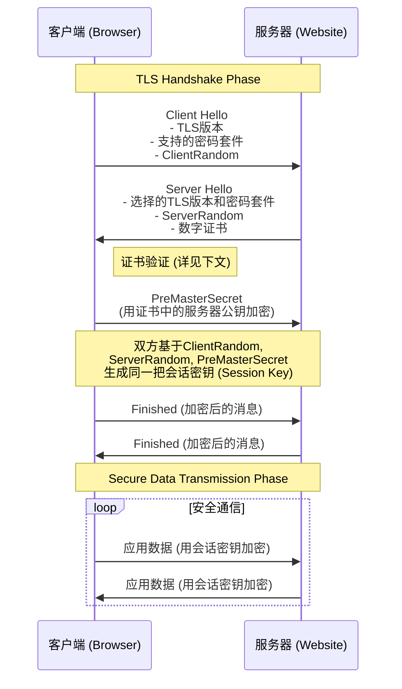

# HTTPS 协议核心原理详解

## 一、HTTPS 是什么？

**HTTPS = HTTP + SSL/TLS**

- **HTTP**：超文本传输协议，负责传输信息，但内容是明文的，不安全。
- **SSL/TLS**：安全套接字层/传输层安全协议，负责在HTTP之下提供安全保护，像一个保镖。
- **目的**：解决HTTP明文传输带来的窃听、篡改和冒充三大风险。
- **端口**：默认使用 **443** 端口（HTTP默认使用80端口）。

### SSL/TLS 提供的三大安全特性

1.  **加密**：通过混合加密算法对传输的数据进行加密，防止数据被窃听，确保**保密性**。
2.  **认证**：通过数字证书验证服务器的身份，防止用户访问到钓鱼网站，确保**真实性**。
3.  **完整性**：通过消息认证码（MAC）机制防止数据在传输过程中被篡改，确保**完整性**。

---

## 二、HTTPS 工作原理：TLS 握手流程

HTTPS的安全核心在于连接建立时的“TLS握手”过程。其目的是在一个不安全的网络上，让客户端和服务器安全地协商出一个只有它们俩才知道的**会话密钥**，用于后续通信的对称加密。

**简化握手流程：**

**流程详解：**

1.  **Client Hello**
    - 客户端向服务器发起连接，并发送：
        - 支持的TLS协议版本（如TLS 1.2, 1.3）。
        - 支持的密码套件列表（如 `TLS_ECDHE_RSA_WITH_AES_256_GCM_SHA384`）。
        - 一个客户端生成的随机数 **`ClientRandom`**。

2.  **Server Hello**
    - 服务器回应客户端，并发送：
        - 选择的TLS版本和密码套件。
        - 一个服务器生成的随机数 **`ServerRandom`**。
        - 服务器的**数字证书**，其中包含其公钥等信息。

3.  **证书验证**
    - **（最关键的步骤，详见下文）** 客户端收到证书后，会验证其真实性、有效性和可信性。如果验证失败，连接将被终止。

4.  **Pre-Master Secret 生成与加密**
    - 证书验证通过后，客户端生成第三个随机数 **`PreMasterSecret`**。
    - 客户端使用证书中提供的**服务器公钥**加密 `PreMasterSecret`，并将加密后的结果发送给服务器。

5.  **会话密钥生成**
    - 服务器用自己的**私钥**解密，得到 `PreMasterSecret`。
    - 此时，客户端和服务器都拥有了三个随机数：`ClientRandom`、`ServerRandom` 和 `PreMasterSecret`。
    - 双方使用相同的算法，根据这三个随机数独立计算出同一把**主密钥（Master Secret）**，进而派生出用于加密和解密的**会话密钥（Session Keys）**。

6.  **握手完成**
    - 双方交换一条用会话密钥加密的“Finished”消息，以确认握手过程本身未被篡改，且密钥协商成功。
    - 至此，TLS握手结束。后续所有的HTTP请求和响应数据都将使用这把高效的**对称会话密钥**进行加密传输。

---

## 三、核心问题：客户端如何验证服务器证书？

客户端验证服务器数字证书是其确认服务器身份、建立信任的关键。验证过程遵循一个清晰的“信任链”模型。

**步骤详解：**

1.  **验证基本信息**
    - **域名检查**：确认当前访问的域名与证书中“Subject Alternative Name (SAN)”字段列出的域名**完全匹配**。不匹配会触发警告。
    - **有效期检查**：确认证书在当前时间是否有效（未过期且已生效）。

2.  **验证签发者（CA）签名（最关键步骤）**
    - 客户端从证书中找到其**签发者（Issuer）**。
    - 在操作系统或浏览器**预置的受信任根证书存储库**中查找该签发者（CA）的**公钥**。
    - 使用该CA公钥去**解密**证书附带的**数字签名**，得到原始哈希值（Hash A）。
    - 客户端使用证书指明的哈希算法，对证书的**明文部分**自行计算一次哈希值（Hash B）。
    - **比对 Hash A 和 Hash B**：如果相等，证明证书内容完整且由该CA签发；如果不相等，证明证书被篡改，验证失败。

3.  **证书链追溯与信任确认**
    - 服务器证书通常由**中间CA**签发，而中间CA又由**根CA**签发，形成一条证书链。
    - 客户端会**递归地**执行步骤2，逐级验证链上每一级证书的签名，直到追溯到一个存在于自己信任存储库中的**根CA**。任何一级验证失败都会导致整个信任链断裂。

4.  **检查吊销状态（可选但重要）**
    - 证书可能因私钥泄露等原因而被CA提前**吊销**。客户端会检查证书是否仍在有效状态。
    - **CRL**：证书吊销列表。一个包含所有已吊销证书序列号的列表文件。
    - **OCSP**：在线证书状态协议。客户端向CA的OCSP服务查询单个证书的状态。
    - **OCSP Stapling**：现代更常用的方式。由服务器在握手时直接提供由CA签名的、证明自己证书有效的OCSP响应，效率更高，隐私性更好。

**信任的根源**：整个系统的安全性建立在**根CA的私钥绝对安全**以及客户端信任存储库（预置的根证书列表）可靠的基础上。

---

## 四、关键问题：为何需要三个随机数？

在握手过程中，客户端和服务器共同贡献了三个随机数（`ClientRandom`, `ServerRandom`, `PreMasterSecret`）来生成主密钥。这主要是为了实现**完美前向保密**。

- **完美前向保密**：即使攻击者在未来**窃取了服务器的私钥**，并且截获了过去的通信流量，他也**无法解密过去的会话**。
- **原因**：因为每次会话的 `PreMasterSecret` 都是临时生成的一次性密钥，且最终的主密钥由三个随机数共同决定。攻击者缺少当时握手明文传输的 `ClientRandom` 和 `ServerRandom`，无法计算出那次会话的密钥。破解一次会话不影响其他任何一次会话。
- **额外好处**：增加了密钥的随机性（熵），并有助于防止重放攻击。

**核心公式：**
`Master Secret` = PRF(`Pre-Master Secret`, "master secret", `Client Random` + `Server Random`)