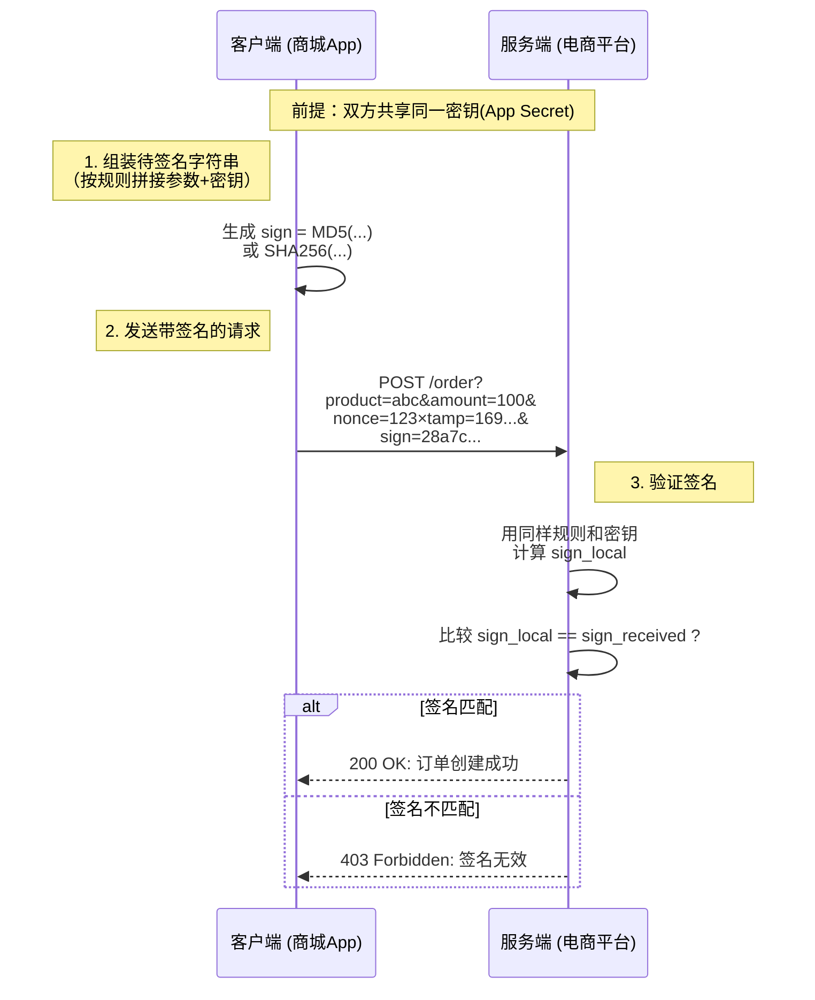

简单来说，**`sign` 就像你寄送一个重要包裹时使用的“封条”和“唯一密码”**。接收方通过检查这个“封条”和“密码”来确认：
1.  **包裹确实是你寄的**（身份认证）。
2.  **包裹在途中没有被拆开篡改过**（数据完整性）。
3.  **这不是一个重复寄送的包裹**（防重放）。

---

### 一、为什么需要 Sign？解决了什么问题？

在没有签名机制的简单API接口中，存在以下巨大风险：

1.  **身份冒充**：攻击者可以完全伪造一个请求，假装是合法客户端在调用接口。例如，冒充他人给自己账户充值。
2.  **数据篡改**：请求在传输过程中可能被中间人（如路由器、运营商）截获并修改参数。例如，将 `100元` 的订单改为 `1元`，或将收款人ID改成攻击者的ID。
3.  **重放攻击**：攻击者虽然不能解密或修改请求，但他可以**原封不动地重复发送**一次合法的请求。例如，你支付成功的请求被截获，攻击者反复发送这个请求，就会导致你被多次扣款。

而 **`sign`** 就是为了解决这三个核心安全问题而设计的。

---

### 二、Sign 的工作原理（核心流程）

签名机制的核心是：**客户端和服务器拥有一个共同的、不对外泄露的密钥（`App Secret`）**。

下图以一个“创建订单”的API请求为例，展示了签名生成与验证的完整流程：

**流程步骤详解：**

1.  **客户端生成签名：**
    *   **组装待签名字符串**：将所有业务参数（如 `product_id=abc&amount=100`）按照预定的规则（如按参数名ASCII码排序）拼接成一个字符串。
    *   **混合密钥**：将最重要的 `App Secret` 拼接到这个字符串的首部或尾部。例如：`secret + product_id=abc&amount=100`。
    *   **计算哈希值**：对这个拼接后的字符串使用哈希算法（如 `MD5`, `SHA256`）进行计算，生成一个唯一的、固定长度的哈希值，这个值就是 **`sign`**。

2.  **客户端发送请求：**
    *   将所有的业务参数和计算得到的 `sign` 一起，通过API请求发送给服务器。**注意：`App Secret` 本身永远不在网络中传输**。

3.  **服务器验证签名：**
    *   **收到请求后，服务器做同样的事情**：它按照相同的规则组装字符串，混合相同的 `App Secret`，并使用相同的哈希算法计算出一个签名值，我们称之为 `sign_local`。
    *   **比对签名**：将计算得到的 `sign_local` 与客户端传来的 `sign` 进行比对。
    *   **决定响应**：
        *   如果两者**完全一致**，证明请求合法、未被篡改。
        *   如果**不一致**，服务器立即返回错误（如 `403 Forbidden`），拒绝请求。

---

### 三、如何应对重放攻击？Sign 的进阶设计

单纯的参数签名可以防篡改，但无法防止重放（因为重放的请求签名也是正确的）。因此，实际的签名方案会加入两个关键参数：

1.  **Timestamp（时间戳）**：
    *   客户端在生成签名时，需要将当前时间戳（如 `timestamp=1697012990`）作为一个参数参与签名。
    *   服务器收到请求后，会检查服务器当前时间与 `timestamp` 是否相差过大（例如，超过5分钟）。
    *   如果时间差超过允许范围，则认为请求已过期，直接拒绝。这样，即使请求被截获，攻击者也只在很短的窗口期内重放它。

2.  **Nonce（随机数）**：
    *   客户端每次请求生成一个唯一的随机字符串 `nonce`，并同样参与签名。
    *   服务器维护一个临时缓存，记录在 `timestamp` 有效期内出现过的 `nonce`。
    *   当收到新请求时，服务器检查该 `nonce` 是否已在缓存中：
        *   如果已存在，说明是重复请求，拒绝。
        *   如果不存在，则记录该 `nonce`，并处理请求。

**`Timestamp` 和 `Nonce` 通常都是生成签名所需的必要参数，二者结合可有效杜绝重放攻击。**

---

### 四、总结：Sign 的核心作用

| 作用           | 说明                                       | 实现方式                                                     |
| :------------- | :----------------------------------------- | :----------------------------------------------------------- |
| **身份认证**   | 确保请求来自合法的客户端。                 | 只有拥有 `App Secret` 的客户端才能生成正确的签名。           |
| **数据完整性** | 确保请求参数在传输过程中未被任何方式篡改。 | 任何对参数的修改都会导致服务器计算的签名与客户端传来的签名不匹配。 |
| **防重放攻击** | 确保同一个请求不能被多次使用。             | 引入 `Timestamp` 和 `Nonce` 参数并参与签名，服务器端进行时效性和唯一性校验。 |

**因此，在电商、支付、金融等对安全要求极高的场景中，为API请求（包括商品查询、订单创建、支付等）添加 `sign` 参数是一种非常必要且标准的安全实践。**